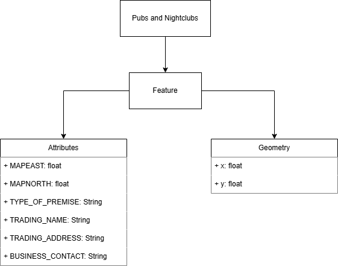

# Implementation

## Introduction
Our project, Pub Quest, aims to provide users with a map of all nearby pubs, nightclubs, wine bars, and cafe bars, serving as a "pub crawl planner". We had plans to include many additional features including route generation, filtering of location types, and saving created routes, however, some features were cut during the development process as we realised we bit off more than we could chew. As a result, our apps features include: table display of all locations; filtering of said table by venue type; search functionality within the table; live, interactable map with functional pins.

The dataset we used gave us 483 records (currently), as well as a lot of data we could work with, including: UPRN, schedule, schedule_json, east, north, type, name, and address. We cut many of the fields such as UPRN and schedule, since this would not be necessary when it came to developing our app. We kept north and east values as stored variables for when it came to implementing our path finding, however, as this feature ended up being cut, these value became obsolete. We mainly worked with the type, name, address, and contact of the premises.

## Project Structure
```
└── 📁docs
    └── 📁.vs
    └── 📁images
    ├── .DS_Store
    ├── contribution.md
    ├── design.md
    ├── implementation.md
    ├── planning.md
    ├── requirements.md
    └── testing.md
└── 📁PubQuestApp
    └── 📁.vscode
    └── 📁fonts
        ├── MiniPixel.otf
        ├── SuperPixel.ttf
    └── 📁images
        ├── buttonDown.png
        ├── buttonUp.png
        ├── map-border.png
        ├── pubQuestLogo.png
        ├── pubQuestLogoBlack.png
        ├── searchBar.png
        ├── searchButtonDown.png
        ├── searchButtonUp.png
    ├── common.js
    ├── filter.html
    ├── filter.js
    ├── index.html
    ├── map.html
    ├── map.js
    ├── plan.html
    └── style.css
└── readme.md
```

### docs
Stores the documentation files of the project.

### PubQuestApp
Stores all the folders and files that are required for the application, such as fonts, images, HTML, JavaScript, and CSS files.

#### fonts
Stores both fonts used throughout the app.

#### images
Stores all images used throughout the app.

#### common.js
JavaScript file for functions called by multiple other files. For example, all of the HTML files need to call the navToggle function, as it is used to define which button is active in the navigation column. Improves maintainability and reduces amount of duplicate code, as all files that share the same functions can call the common.js file.

#### filter.html
The filter page displays a table, of which results are passed into from the filter.js file, and has 4 toggleable filter buttons above said table, defined within this HTML file.

#### filter.js
Provides the data to be displayed in the filter.html file's table. Also provides filter buttons with functionality, and handles the APIs, passing them into the outputTable function to define data which should be displayed.

#### index.html
This is the landing page of the website, which currently has no content, but we aim to add content to this page in the future if we choose to persue the project further. It allows users to access all other pages through the navigation buttons.

#### map.html
Same layout as other pages in terms of navigation bar, etc. Defines an area for the map to be loaded from map.js script.

#### map.js
Handles the generation of the map for the map.html page, as well as the markers displayed on the map.

#### plan.html
This page is also currently empty as a placeholder for future development, as what was meant to be on this page was cut during this time period of development. Again, we would love to add content to this page, if we choose to continue developing this project, which we are leaning towards.

#### style.css
CSS responsible for most, if not all of, the layout and aesthetics of the site. 

### readme.md
Describes overview of the project. Also provides links to the documentation files, as well as the OpenData Bristol dataset used, and a hosted version of the website throught GitHub Pages.

TODO: provide a table listing the number of jslint warnings/reports for each module.

## Software Architecture
TODO: Describe the major components of your architecture. Are any particular architectural styles being used?

![SoftwareArchitecture]/(images/architecture.png)

## Bristol Open Data API
All APIs return the following fields: MAPEAST, MAPNORTH, TYPE_OF_PREMISE, TRADING_NAME, TRADING_ADDRESS, BUSINESS_CONTACT

Results with type being EXACT match to query - https://maps2.bristol.gov.uk/server2/rest/services/ext/ll_leisure_and_culture/MapServer/14/query?where=TYPE_OF_PREMISE%20%3D%20'${enc}'&outFields=MAPEAST,MAPNORTH,TYPE_OF_PREMISE,TRADING_NAME,TRADING_ADDRESS,BUSINESS_CONTACT&outSR=4326&f=json

Results with type being SIMILAIR match to query - https://maps2.bristol.gov.uk/server2/rest/services/ext/ll_leisure_and_culture/MapServer/14/query?where=TYPE_OF_PREMISE%20%LIKE%20'${enc}'&outFields=MAPEAST,MAPNORTH,TYPE_OF_PREMISE,TRADING_NAME,TRADING_ADDRESS,BUSINESS_CONTACT&outSR=4326&f=json

All results - https://maps2.bristol.gov.uk/server2/rest/services/ext/ll_leisure_and_culture/MapServer/14/query?where=1%3D1&outFields=MAPEAST,MAPNORTH,TYPE_OF_PREMISE,TRADING_NAME,TRADING_ADDRESS,BUSINESS_CONTACT&outSR=4326&f=json

Results with any field with SIMILAIR match to search input - https://maps2.bristol.gov.uk/server2/rest/services/ext/ll_leisure_and_culture/MapServer/14/query?where=&text=${enc}&outFields=MAPEAST,MAPNORTH,TYPE_OF_PREMISE,TRADING_NAME,TRADING_ADDRESS,BUSINESS_CONTACT&outSR=4326&f=json



# User guide
Due to the fact multiple features were cut, only use case 6 was actually met, as described in the following guide. Although this was the case, other necessary features that were not initially specified in the breif were included in the current finished version of the website.


This is the first page the user will see when they load the website. It is currently empty content-wise, but has a number of buttons that allow the user to navigate the site.


By clicking on the "Filter Local Venues" button, the user is redirected to the "Filter" page, in which all venues are displayed in a table. This page checks off the only use case we could meet in this project, that being use case 6. The user then has 4 options to choose from in terms of filtering the local venues, displayed just above the table: "Cafe Bars", "Nightclubs", "Pubs", and "Wine Bars". Pressing the "Filter Local Venues" button again will redirect the user back to the home screen/ "index".


Here is an example of what will show when the user presses one of the filter buttons, in this case, the "Cafe Bars" filter. The table will reload to show only records that are "Cafe Bars". The user can press any of the other 3 buttons to change which venue type they would like to see, or they can press the same button again to remove the currently applied filter, showing all records once again.


In the top right hand corner of the page is a search bar and button, which tie into the functionality of the "Filter" page. If the user enters a value into the search bar and presses the search button, the table will reload and display all records that contain the value typed in by the user. In this example, "vil" is used, and therefore "*Vil*lager" and "Ash*vil*le" are both displayed. The user can use the search page on whichever page they please. Once they press the search button, they will automatically be redirected to the "Filter" page with the correct records being shown in the table. By pressing the search button again without a value inside the search bar, all results will be shown in the table.


Moving on, pressing the "View Local Venues" button will load up a map of Bristol, populated with a large number of pins. The first time the button is pressed, the user will be prompted to allow location services. If they allow, the center of the map will be the users current position, however, if not, the map will center on the center of Bristol. The user can zoom and pan around the map, and click on pins to see extra information. This page also fulfils use case 6. Again, pressing the currently selected button (in this case "View Local Venues"), the user will be redirected back to the home page.


The final page the user can access through the navigation menu is the "Plan" page through the "Plan A Crawl" button. This page is also blank due to the cut features, but is setup ready for when the features are implemented. Pressing the same button again will take the user back to the home page
