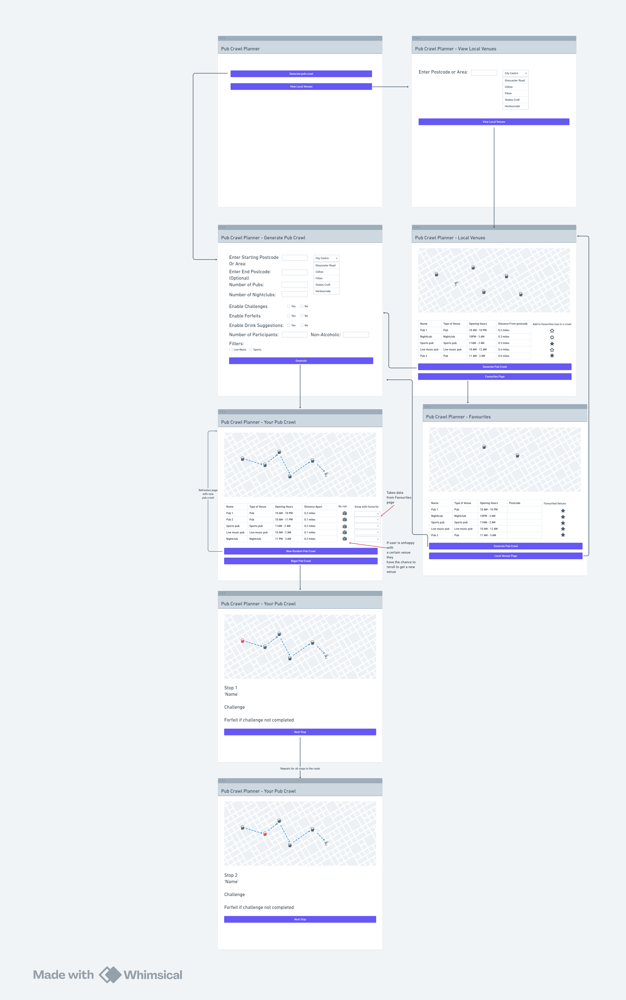

# Design
The wireframe diagram below shows the initial user interface for the pub crawl planning app. It outlines the different pages that a user will move through when using the system, starting from the main menu and going through the process of finding venues by allowing the user to enter a postcode or area to search for pubs and view venues on a map. The system can then generate a pub crawl, allowing the user to customise it using features such as the number of pubs, participants, and optional challenges. Users can also save favourite venues and then follow the generated crawl step by step, with each stop displayed on the map along with any related challenges.
## User Interface design
