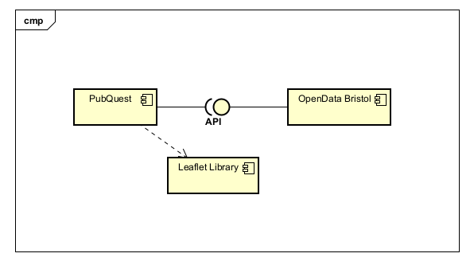

# Implementation

## Introduction
TODO: Describe the system implemented (Describe the dataset. Are there any known issues? Describe any configuration data).

## Project Structure
TODO: Provide an outline of the project folder structure and the role of each file within it.
provide a table listing the number of jslint warnings/reports for each module.

## Software Architecture
TODO: Describe the major components of your architecture. Are any particular architectural styles being used?

## Bristol Open Data API
All APIs only return the following fields: MAPEAST, MAPNORTH, TYPE_OF_PREMISE, TRADING_NAME, TRADING_ADDRESS, BUSINESS_CONTACT

Results with type being EXACT match to query - https://maps2.bristol.gov.uk/server2/rest/services/ext/ll_leisure_and_culture/MapServer/14/query?where=TYPE_OF_PREMISE%20%3D%20'${enc}'&outFields=MAPEAST,MAPNORTH,TYPE_OF_PREMISE,TRADING_NAME,TRADING_ADDRESS,BUSINESS_CONTACT&outSR=4326&f=json

Results with type being SIMILAIR match to query - https://maps2.bristol.gov.uk/server2/rest/services/ext/ll_leisure_and_culture/MapServer/14/query?where=TYPE_OF_PREMISE%20%LIKE%20'${enc}'&outFields=MAPEAST,MAPNORTH,TYPE_OF_PREMISE,TRADING_NAME,TRADING_ADDRESS,BUSINESS_CONTACT&outSR=4326&f=json

All results - https://maps2.bristol.gov.uk/server2/rest/services/ext/ll_leisure_and_culture/MapServer/14/query?where=1%3D1&outFields=MAPEAST,MAPNORTH,TYPE_OF_PREMISE,TRADING_NAME,TRADING_ADDRESS,BUSINESS_CONTACT&outSR=4326&f=json

Results with any field with SIMILAIR match to search input - https://maps2.bristol.gov.uk/server2/rest/services/ext/ll_leisure_and_culture/MapServer/14/query?where=&text=${enc}&outFields=MAPEAST,MAPNORTH,TYPE_OF_PREMISE,TRADING_NAME,TRADING_ADDRESS,BUSINESS_CONTACT&outSR=4326&f=json

!(images/exactClass.png)
!(images/likeClass.png)
!(images/allClass.png)
!(images/searchClass.png)

# User guide
TODO: Explain how each use-case works by providing step-by-step screenshots for each use-case. This should be based on a tested scenario.