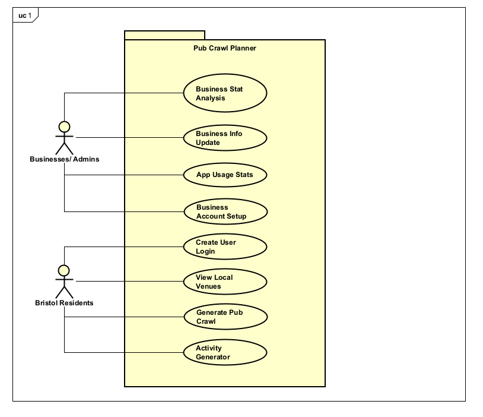

# Requirements

## User Needs

### User stories
TODO: Write brief user stories to explain how various actors would interact with the system to accomplish a goal.
    Express these in the form from agile development:- As a (role) I want (goal) so that (benefit).

- As a bar/ nightclub/ pub business in Bristol, I want to be able to view and analyse route data involving the business so that I can make changes to my strategies based on the data so that I can attract more customers and maintain a larger customer base.

- As an admin/ engineer of the app, I want to be able to manage all information stored behind the scenes, including viewing, changing, adding and deleting data, so that the app stays up to date, and so that businesses can setup their user accounts through my confirmation.

- As a student who has just moved to Bristol, I want to be able to view pubs, bars and nightclubs in the area with a way to plot a route for a night out so that I can get used to the area and what it has to offer, while making new friends and getting closer to my existing ones.

- As someone who has lived in Bristol for 10+ years, I want to be able to make going out more fun by having activities to do on my pub crawl so that friends are more willing to come out and so nights out are more fun and interesting.

### Actors
- Businesses (Bars, Pubs, Nightclubs): Businesses that will be included in the dataset and so will have an interest in the app as it can provide information about common pub crawl routes
    - View total number of times their venue has been included in generated crawl routes to help analyse business footfall
    - Update/ amend information displayed about their business on the site specifically (not Bristol database info) to keep users up to date on general business info, events and live music, and more
    - View most popularly visited locations before and after their business to help scout competition/ highlight opportunities to work together
    - Login with business credentials to access previous info and functions

- Admins/ Engineers: Managers and maintenance of the application, responsible for keeping the app up to date
    - View total app usage statistics to see what needs updating/ improving
    - View in depth details of each location
    - Setup business accounts so that they can access the necessary features

- New Bristol Residents: people who have recently moved to Bristol, with a high majority being students
    - View pubs, nightclubs and bars in the area
    - Create a pub crawl route for the night out
    - Login to be able to save created routes

- Existing Bristol Residents
    - Create a list of activities for a night out, multiple for each numbered location
    - View pubs, nightclubs and bars in the area

### Use Cases

| TODO: USE-CASE ID e.g. UC1, UC2, ... | TODO: USE-CASE NAME | 
| -------------------------------------- | ------------------- |
| **Description** | TODO: Goal to be achieved by use case and sources for requirement |
| **Actors** | TODO: List of actors involved in use case |
| **Assumptions** | TODO: Pre/post-conditions if any |
| **Steps** | TODO: Interactions between actors and system necessary to achieve goal |
| **Variations** | TODO: OPTIONAL - Any variations in the steps of a use case |
| **Non-functional** | TODO: OPTIONAL - List of non-functional requirements that the use case must meet. |
| **Issues** | TODO: OPTIONAL - List of issues that remain to be resolved |

| USE-CASE 1 | Business Stat Analysis - Tyler |
| -------------------------------------- | ------------------- |
| **Description** | View total times a venue has been used in a crawl |
| **Actors** | Businesses, Admins/ Engineers |
| **Assumptions** | Business/ Admin has login setup to access data |
| **Steps** | 1. Get business data from venue database; 2. View statistics page |
| **Variations** | 1. Not logged into a business account |
| **Non-functional** | Should run on a variety of devices and browsers |
| **Issues** |  |

| USE-CASE 2 | Business Info Update - Tyler | 
| -------------------------------------- | ------------------- |
| **Description** | Update business information on the site to keep users up to date with events and other info |
| **Actors** | Businesses, Admins/ Engineers |
| **Assumptions** | Business/ Admin has login setup to access data |
| **Steps** | 1. Get business data from venue database; 2. View statistics page; 3. Accept user input; 4. Append data to venue database |
| **Variations** |  |
| **Non-functional** | Should run on a variety of devices and browsers |
| **Issues** |  |

| USE-CASE 3 | App Usage Stats - Tyler |
| -------------------------------------- | ------------------- |
| **Description** | View information regarding the amount of crawls generated, how many users there are, etc. |
| **Actors** | Admins/ Engineers |
| **Assumptions** | Admin has login setup to access data |
| **Steps** | 1. Get usage data from venues database; 2. View statistics page |
| **Variations** | 1. Not logged into an admin account |
| **Non-functional** | Should run on a variety of devices and browsers |
| **Issues** |  |

| USE-CASE 4 | Business Account Setup - Tyler |
| -------------------------------------- | ------------------- |
| **Description** | Provide businesses with a unique login so they can access relevant information |
| **Actors** | Businesses, Admins/ Engineers |
| **Assumptions** | Admin has login setup to access data; Each business already has unique login generated and stored in a database, waiting to be activated on businesses request |
| **Steps** | 1. Get searched business' login info from login database; 2. View single-use login credentials |
| **Variations** | 1. Business is not found in database (could be new) |
| **Non-functional** | Should run on a variety of devices and browsers |
| **Issues** | Relies on admin to complete setup which could delay account being sorted |

| USE-CASE 5 | Create User Login - Connor |
| -------------------------------------- | ------------------- |
| **Description** | How new users can create a their own account to loign. this can be used to access personalised features for their pub crawls. Some examples include: saving routes, showing a history of past pub crawls/routes  |
| **Actors** | Exsisting Bristol residents and new Bristol residents |
| **Assumptions** | 1.The servers are online and can easily store new users and their data securely 2.Users can easily access login page 3. the user has a valid email address |
| **Steps** |  1. User goes to 'Sign up' page to make an account 2. The user enters the details that the system requires like email and password 3. The system checks if the email has already been used  4. The system stores the users credentials in the database, confirming account creation  5. The user can now login |
| **Variations** | 1. Email already in use 2. Missing fields (like filling out the email but not a password) |
| **Non-functional** | Process must not take too long to complete, UI must be user friendly, any issues with the login process must be made clear to the user  |
| **Issues** | If the user forgets their password and are unable to recover their account |

| USE-CASE 6 | View Local Venues - Connor |
| -------------------------------------- | ------------------- |
| **Description** | Describes how the user can view local venues near their location or chosen area to plan the pub crawl |
| **Actors** | Exsisting Bristol residents and new Bristol residents |
| **Assumptions** | 1. The user has access to the venue listing page 2. Information about each venue (name, opening hours, location, events) exsists in the sysems's database |
| **Steps** | 1. User opens 'Local Venues' page 2. User inputs their current or desired location 3. System shows nearby venues and information from its database and displays in a list/map of venues 4. User selects a venue to view more details 5. System displays chosen venue and information |
| **Variations** | 1. A choice of map view or list view to allow users to switch between formats for what is easier to use 2. Sort by options, to allow users to filter between differes things like distance, opening hours, type of music 3. Page displays 'No venues found' of there arent any in the area that the user inputs |
| **Non-functional** | Should run on a variety of devices and browsers |
| **Issues** | Venue information may be outdated, location accuracy may be incorrect  |

| USE-CASE 7 | Generate Pub Crawl - Connor |
| -------------------------------------- | ------------------- |
| **Description** | How the user generates a pub crawl route based on their preferences |
| **Actors** | Exsisting Bristol residents and new Bristol residents |
| **Assumptions** | User has entered their starting location |
| **Steps** | 1. User navigates to the “Generate Pub Crawl” page 2. User sets preferences 3 User clicks the 'Generate Route' button 4.System fetches venue data relevant to preferences 5. System generates a route and displays it on a map and/or list |
| **Variations** | System optimises for a route with the shortest walk, User can manually edit their generated route |
| **Non-functional** | Should run on a variety of devices and browsers |
| **Issues** | System may generate inefficient routes that the user cant or doesnt want to complete |

| USE-CASE 8 | Activity Generator - Connor |
| -------------------------------------- | ------------------- |
| **Description** | The system can generate fun challenges and activities for users to complete at each venue during a pub crawl, including forfeits if challenges are not completed. |
| **Actors** | Exsisting Bristol residents and new Bristol residents |
| **Assumptions** | A pub crawl route has already been generated, user has the chocie to choose if they want challenegs in their crawl, user has access to the activity generator feature |
| **Steps** | 1. User generates a pub crawl route 2. User enables 'Activity Generator' 3. System generates a challenge for each venue on the crawl 4. System displays the challenge and associated forfeit 5. User attempts the challenge at the venue 6. User marks the challenge as completed or failed 7. System records progress and moves to the next venue’s activity |
| **Variations** | Be able to choose the difficulty of the challenges, like easy, medium or hard. The choice to skip or reroll challaenges if the user isnt happy with their given one. Group challanges so everyone on the route has the same challenge. |
| **Non-functional** | Should run on a variety of devices and browsers |
| **Issues** | There may be arguments over whether a challenge was completed, repeated challenges may reduce enjoyment |

## Software Requirements Specification
### Functional requirements
TODO: create a list of functional requirements. 
    e.g. "The system shall ..."
    Give each functional requirement a unique ID. e.g. FR1, FR2, ...
    Indicate which UC the requirement comes from.

    | Tyler |

    FR1 - The system shall store venue statistics and allow for later access by businesses. - UC1
    FR2 - The system shall allow businesses to access and update their information on the site. - UC2
    FR3 - The system shall store app usage statistics and allow for later access by admins. - UC3
    FR4 - The system shall allow admins to approve/ create logins for requesting businesses. - UC4
    FR5 - The system shall store user login info - UC4, UC5

### Non-Functional Requirements
TODO: Consider one or more [quality attributes](https://en.wikipedia.org/wiki/ISO/IEC_9126) to suggest a small number of non-functional requirements.
Give each non-functional requirement a unique ID. e.g. NFR1, NFR2, ...

Indicate which UC the requirement comes from.

    | Tyler |

    NFR1 - Accuracy: The system should store and provide accurate readings on venue statistics to businesses. - UC1
    NFR2 - Usability: The system should have an easy to use interface for businesses and admins to access information. - UC1, UC3
    NFR3 - Installability: The system should allow for easy business account setup by admins. - UC4