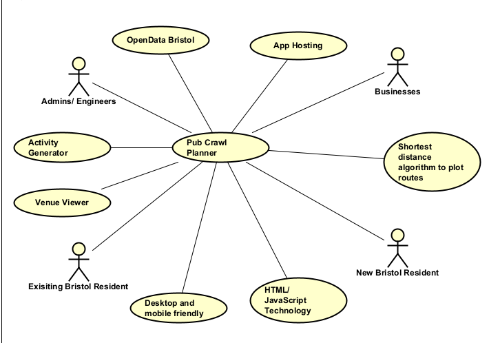

# Project Proposal
Pub Crawl Planner

## Business Case

### Problem statement
- Our app aims to provide young to middle-aged adults, especially those new to Bristol, with a tool to discover new pubs and nightclubs in their general area, or all across the city. This will help solve the problem that many new residents may face when moving new to a new city, which is the unfamiliarity of the area, which can make it exceptionally hard to plan nights out with friends or family. However, not only will our web based application aid newcomers to Bristol, it can also benefit users who are familiar with the city. The secondary problem we attempt to solve is the lack of activities that can be carried out on a pub crawl/ night out, in turn potentially making the meeting fairly boring. By implementing some sort of pub crawl activity planner, this problem can be quite easily tackled.

### Business benefits
- Provides easier way to organise a night out, encouraging exploration of local areas, espeicially to people new to the city.
- Offers additional features to help make a night out more enjoyable such as activities, challenges, forfeits, etc.
- Smaller pubs gaining brand awareness and potentially earning long-term customer loyalty
- Helps organise when and where live music/ other events are taking place

### Options Considered
- BarCrawl: https://www.barcrawl.co.uk/
    + Range of cities to choose from (low relevance as limited to Bristol Dataset)
    + Embedded google maps view
        - Issues with embed not showing correct pub locations
    + Ability to save crawl after login
    + Can view existing pubs crawls created by other users
    + Saves most recently created pub crawl using cookies
    + Can view crawls created by other users, which can also be sorted by city
    + Ability to search for all pubs in a city
    + Can submit reviews on the site for specific venues
        - Rarely used feature as most pubs lack any reviews written on the site: sourcing reviews from external sites such as Google Maps would be more effective
    - Unfriendly UI: very confusing and looks like it was made 20 years ago
    - Limited to number of pubs, cant do time limit
    - Issues generating the crawl intself: not generating all requested pubs crawl
    - Fairly limited information included on pub description pages

- DayTrips: https://www.daytrips.ai/pub-crawl
    + AI meaning large amount of data at its disposal
    + Allows users to tailor their crawl to their prefered drink
        - Can only select prefered drinks from different types of beers
    + Includes both time spent out and number of pubs to visit
    + Suggests time spent at each location
    + Generates GoogleMaps embed with route plotted out
    + Links to each pub included with descriptions of each too
    - Cant select specific starting location or general location: limited to city
    - Logo not suited to dark mode, affecting sites appeal to users
    - No tab thumbnail, also affecting the sites overall appeal
    - AI doesn't have dedicated use to this application, so may generate useless results based on user input: works similairly to any other AI framework

- Vondy: https://www.vondy.com/pub-crawl-generator--lVUgFVhf
    + AI meaning large amount of data at its disposal
    + Gives a list of templates to generate a crawl from
        - Doesn't allow any specification of location or any other info: limited relevance
    + Provides description and activies for each locaiton on the crawl
    + Travel tips included, such as footware, travel methods and opening times
    - Doesn't consider opening times, relying on the user doing so externally
    - Asks if user would like illustration of the map, however, no way to reply yes
    - AI doesn't have dedicated use to this application, so may generate useless results based on user input: works similairly to any other AI framework

- Pubs Galore: https://www.pubsgalore.co.uk/pub-crawl-planner/pub-selection-tool.php:
    + Home page is a map showing pubs in the area
    + Clicking on specific pubs shows a large amount of info, including address, reviews, links to the venues sites, and an embedded map to show location
    - Unfriendly user interface that looks like it was designed 20 years ago: hard to find desired features, very cluttered and text heavy

### Expected Risks
- Laws involving drinking must be emphasised
- If maps are inaccurate, user could end up lost
- Login information must be secure, if not data could be prone to breach
- Data (such as route data, personal info, etc) must be given permission to be stored/ shared with businesses as if not, it could breach data protection act

## Project Scope // should be clear and include all relevant actors
TODO: Scope of the System of Interest. Include a bullet list of things from your context diagram that are in scope.

