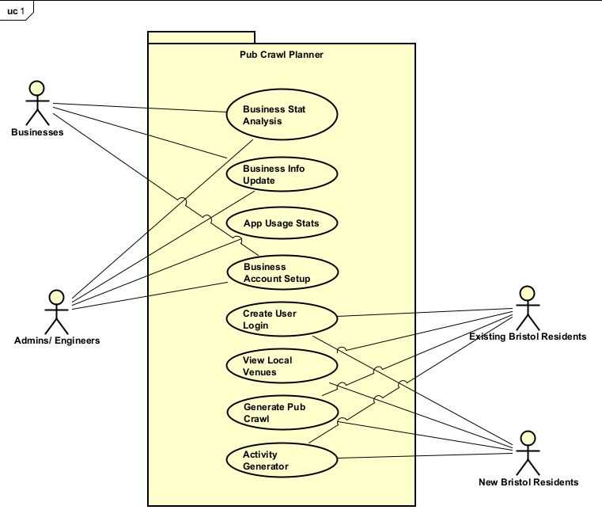

# Requirements

## User Needs

### User stories
TODO: Write brief user stories to explain how various actors would interact with the system to accomplish a goal.
    Express these in the form from agile development:- As a (role) I want (goal) so that (benefit).

- As a bar/ nightclub/ pub business in Bristol, I want to be able to view and analyse route data involving the business so that I can make changes to my strategies based on the data so that I can attract more customers and maintain a larger customer base.

- As an admin/ engineer of the app, I want to be able to manage all information stored behind the scenes, including viewing, changing, adding and deleting data, so that the app stays up to date, and so that businesses can setup their user accounts through my confirmation.

- As a student who has just moved to Bristol, I want to be able to view pubs, bars and nightclubs in the area with a way to plot a route for a night out so that I can get used to the area and what it has to offer, while making new friends and getting closer to my existing ones.

- As someone who has lived in Bristol for 10+ years, I want to be able to make going out more fun by having activities to do on my pub crawl so that friends are more willing to come out and so nights out are more fun and interesting.

### Actors
TODO: List and describe the actors/users for this product.

- Businesses (Bars, Pubs, Nightclubs): Businesses that will be included in the dataset and so will have an interest in the app as it can provide information about common pub crawl routes
    - View total number of times their venue has been included in generated crawl routes to help analyse business footfall
    - Update/ amend information displayed about their business on the site specifically (not Bristol database info) to keep users up to date on general business info, events and live music, and more
    - View most popularly visited locations before and after their business to help scout competition/ highlight opportunities to work together
    - Login with business credentials to access previous info and functions

- Admins/ Engineers: Managers and maintenance of the application, responsible for keeping the app up to date
    - View total app usage statistics to see what needs updating/ improving
    - View in depth details of each location
    - Setup business accounts so that they can access the necessary features

- New Bristol Residents: people who have recently moved to Bristol, with a high majority being students
    - View pubs, nightclubs and bars in the area
    - Create a pub crawl route for the night out
    - Login to be able to save created routes

- Existing Bristol Residents
    - Create a list of activities for a night out, multiple for each numbered location
    - View pubs, nightclubs and bars in the area

### Use Cases
TODO: Describe each use case (at least one per team member).
    Give each use case a unique ID, e.g. UC1, UC2, ...
    Summarise these using the use-case template below.

| TODO: USE-CASE ID e.g. UC1, UC2, ... | TODO: USE-CASE NAME | 
| -------------------------------------- | ------------------- |
| **Description** | TODO: Goal to be achieved by use case and sources for requirement |
| **Actors** | TODO: List of actors involved in use case |
| **Assumptions** | TODO: Pre/post-conditions if any</td></tr>
| **Steps** | TODO: Interactions between actors and system necessary to achieve goal |
| **Variations** | TODO: OPTIONAL - Any variations in the steps of a use case |
| **Non-functional** | TODO: OPTIONAL - List of non-functional requirements that the use case must meet. |
| **Issues** | TODO: OPTIONAL - List of issues that remain to be resolved |

TODO: Your Use-Case diagram should include all use-cases.

## Software Requirements Specification
### Functional requirements
TODO: create a list of functional requirements. 
    e.g. "The system shall ..."
    Give each functional requirement a unique ID. e.g. FR1, FR2, ...
    Indicate which UC the requirement comes from.

### Non-Functional Requirements
TODO: Consider one or more [quality attributes](https://en.wikipedia.org/wiki/ISO/IEC_9126) to suggest a small number of non-functional requirements.
Give each non-functional requirement a unique ID. e.g. NFR1, NFR2, ...

Indicate which UC the requirement comes from.
